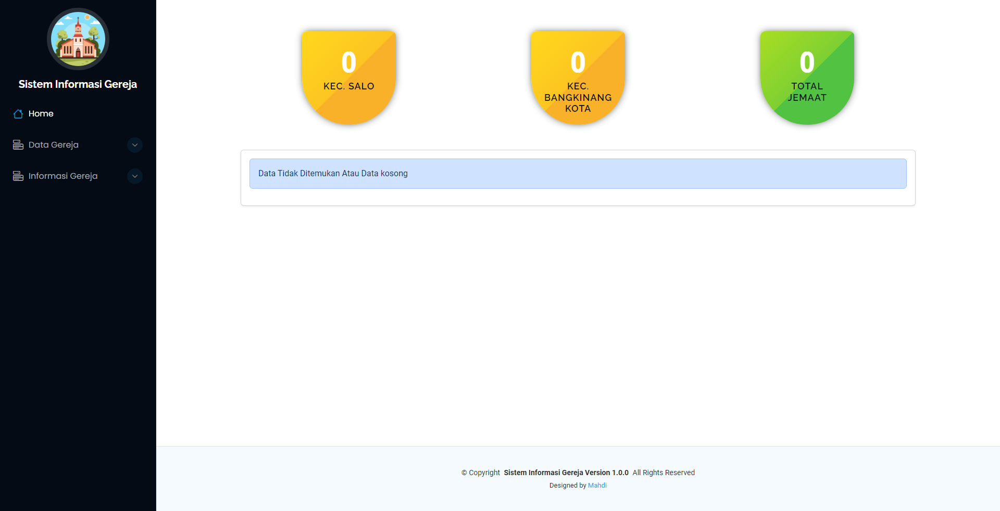
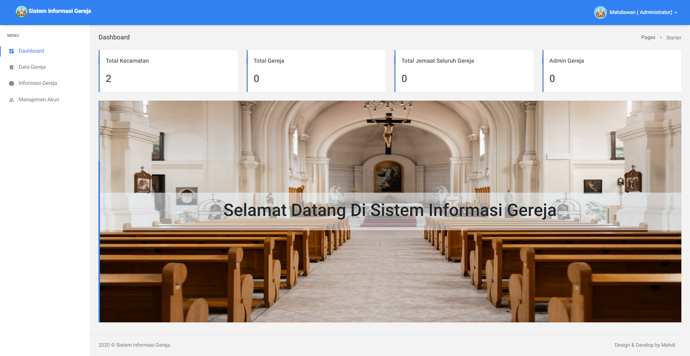

## GraceHub V 1.0 

<b>
GraceHub adalah sistem Pusat informasi dan manajemen gereja yang mempermudah pengelolaan kegiatan dan komunikasi antar jemaat.
</b>

## Back End

## Requirments
- PHP 7.3

## Setup 

### Langkah 1: Setup Aplikasi
1. **Unduh dan Ekstrak Aplikasi**:
    - download zip <a href="https://github.com/mahdiawan-nk/GraceHub/archive/refs/heads/main.zip">disini</a> 
    - atau clone : git clone https://github.com/mahdiawan-nk/GraceHub.git
    - Ekstrak file zip yang telah diunduh.
    - Pindahkan folder hasil ekstraksi ke dalam direktori `htdocs` di dalam folder XAMPP. Misalnya, `C:\xampp\htdocs\graceHub`.

2. **Akses Halaman Instalasi**:
   - Buka browser dan akses `http://localhost/graceHub/install` (untuk XAMPP).

### Langkah 2: Pengaturan Aplikasi
1. Isi formulir pengaturan aplikasi dengan informasi berikut:
   - **Nama Aplikasi**: Nama aplikasi Anda
   - **Penulis**: Nama penulis aplikasi
   - **Deskripsi Aplikasi**: Deskripsi singkat tentang aplikasi

2. Klik tombol `Next` untuk melanjutkan ke langkah berikutnya.

### Langkah 3: Pengaturan Database
1. Isi formulir pengaturan database dengan informasi berikut:
   - **DB Hostname**: `localhost` (atau hostname database server Anda)
   - **DB Username**: Username database Anda (misalnya, `root`)
   - **DB Password**: Password database Anda
   - **DB Name**: Nama database yang akan digunakan

2. Klik tombol `Next` untuk melanjutkan ke langkah berikutnya.

### Langkah 4: Pengaturan Akun Administrator
1. Isi formulir pengaturan akun administrator dengan informasi berikut:
   - **Nama Lengkap**: Nama lengkap administrator
   - **Username**: Username administrator
   - **Email**: Email administrator
   - **Password**: Password untuk administrator

2. Klik tombol `Install` untuk menyelesaikan proses instalasi.

### Langkah 5: Selesai
1. Setelah proses instalasi selesai, Anda akan diarahkan ke halaman login.
2. Masukkan username dan password administrator yang telah Anda buat untuk masuk ke aplikasi.

## Fitur
# Front / Depan
- Home (Halaman home,menampilkan jumlah gereja, card gereja)
- Data Gereja : menampilkan informasi data gereja yang ada
- Informasi Gereja : menampilkan informasi kegiatan dan jadwal pada gereja

# admin
- Autentikasi
- Halaman Dashboard
- Manage User (CRUD)
- Manage Data Gereja (CRUD)
- Manage Inforamsi Gereja (CRUD)

# Operator
- Autentikas
- Halaman Dashboard
- Manage Data Gereja (RU)
- Manage Inforamsi Gereja (CRUD)